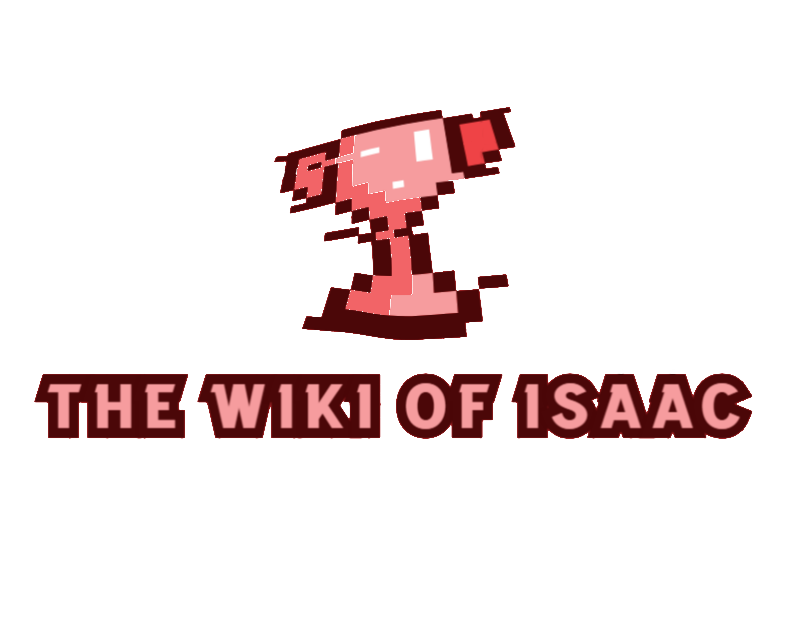
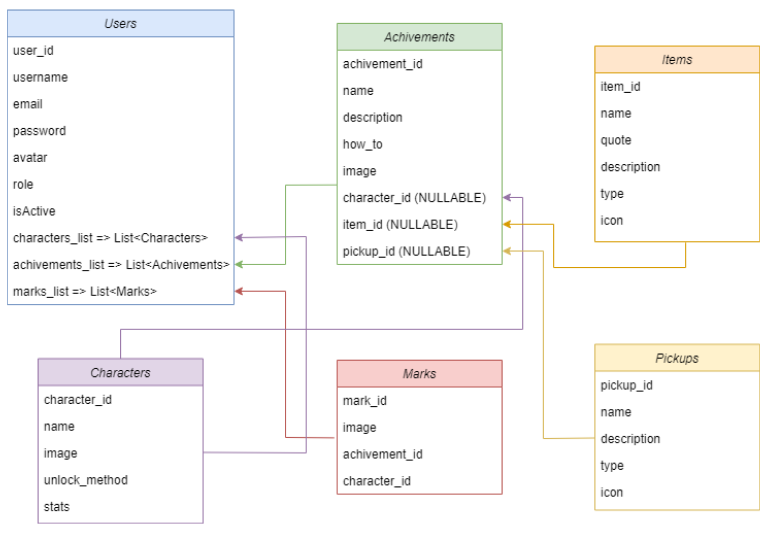

<h1 align="center">
  <br>
  <a href="https://github.com/CariblaGIT/TWOI-Backend"></a>
</h1>

<h4 align="center">API for gaming progress application</h4>

<p align="center">
  <a href="#-key-features">Key Features</a> •
  <a href="#-project-objective">Project objective</a> •
  <a href="#️-stack">Stack</a> •
  <a href="#-installation">Installation</a> •
  <a href="#-api">API</a> •
  <a href="#️-future-improvements">Future improvements</a> •
  <a href="#-you-may-also-like">You may also like...</a>
</p>

## 🔑 Key Features

* Implementation of API REST backend using Express, MongoDB and Mongoose 
* Identification of users by role to access to the different API consults achieved by tokens using JWT (JSON Web Token)
* Server created with Docker and checked with MongoDBCompass Workbench
* Encryptation of the user password using bcrypt
* Data simulated with seeders and generated manually, based on the game The Binding of Isaac
* Multiple entities to store all the data from the game: characters, challenges, items...

## 🎯 Project objective

This API is a project focused on the correct implementation of the methods, structure and parts related to the backend of an application that uses a personalized API REST. Focusing on the bussiness model, this project tries to represent how will be the back-end logic for a gaming progress application, with the users related to their advancements on the game with achievements and marks (giving or removing them) and in addition the way to storage the other data that is not directly connected with the user, as the pickups you can collect on each game or the items you can take. 

## ⌨️ Stack
<div align="center">
<a href="https://developer.mozilla.org/es/docs/Web/JavaScript" style="text-decoration:none">
    
</a>
<a href="https://www.postman.com/" style="text-decoration:none">
    
</a>
<a href="https://www.npmjs.com/" style="text-decoration:none">
    
</a>
<a href="https://jwt.io/" style="text-decoration:none">
    
</a>
<a href="https://www.docker.com/" style="text-decoration:none">
    
</a>
<a href="https://www.mongodb.com/es" style="text-decoration:none">
    
</a>
<a href="https://expressjs.com/en/" style="text-decoration:none">
    
</a>
<a href="https://nodejs.org/en" style="text-decoration:none">
    
</a>
<a href="https://babeljs.io/" style="text-decoration:none">
    
</a>
</div>

## 👨‍💻 Installation

Follow the steps to emulate the project in your local device. But is not necessary because the project has been uploaded to FL0, so you can skip the installation and use the following URL to make all the consults in front of your localhost one: 
<div align="center">
<a href="https://twoi-backend-production.up.railway.app/api/healthy">🚀 API Deployed on FL0 🚀</a>
</div>

1. Clone repo
2. Install dependencies:
    ```bash
    npm install
    ```
3. Create a Docker container using a mongo image with the credentials you want to use
4. Create a .env file with your data from the docker you are using on the project, following the .env.sample file variables and at that level of the director files
5. Insert data into database using the seeder command:
    ```bash
    npm run seeder
    ```
6. Initialize API:
    ```bash
    npm run dev
    ```
7. Use the endpoints on Postman or other applications with the respective elements to get all data

## 🔗 API

The API is a non relational API in which there is a main entity: Users; and other entities that can be interacted or not with the user: Achievements, Items, Pickups, etc.; that are referenced with the _id property from the users in the achievements, characters and marks interactions that have between them as is shown on the next diagram:

<div align="center">

</div>

### Endpoints and what does each one

On this section, are shown all the endpoints from my API and what does each one, splitted by the differents methods and tables that are related with the consult. <b>IMPORTANT</b>: The super_admin restricted methods are only usable if a user from the DB has logged in using the /auth/login method and has assigned that role, generating a JWT token saved on the request at the tokenData object inside it. If you are using some applications like Postman to check that security, you have to copy paste it inside the Bearer Token Authorization tab. Moreover, there are some other methods that has to be logged as /profile.

Also, here you will get the data from 4 users that are created by the seeder as default users, to have data to make the petitions you desire (if you dont execute the seeder, you will not have created this data, and you will not create the random data for all the entities too):

<br>

* USERS

```JSON
{
    {
        "username": "adminTWOI",
        "email": "admin@admin.com",
        "password": "Admin123#",
        "role": "admin",
    },
    {
        "username": "ElLuchadorBITW",
        "email": "caribla4@gmail.com.com",
        "password": "superAdmin1234#",
        "role": "admin",
        "characters": ["6634aa90e5fc477b76acb847"],
        "achievements": ["6634aa90e5fc477b76acb893", "6634aa90e5fc477b76acb894", "6634aa90e5fc477b76acb895", "6634aa90e5fc477b76acb896","6634aa90e5fc477b76acb897"],
        "marks": ["6634aa90e5fc477b76acb8a1", "6634aa90e5fc477b76acb8a2", "6634aa90e5fc477b76acb8a3", "6634aa90e5fc477b76acb8a4", "6634aa90e5fc477b76acb8a5"]
    },
    {
        "name": "user",
        "email": "user@user.com",
        "password": "User12345#",
        "role": "user"
    },
    {
        "name": "user2",
        "email": "user2@user2.com",
        "password": "User12345#",
        "role": "user"
    }
}
```

#### Auth entity

| METHOD     | URL                      | Description                                                                 |
| ---------- | ------------------------ | --------------------------------------------------------------------------- |
| `POST`     |`/api/auth/register`      | Register method to create an user (by default, will have the user role)     |                    
| `POST`     |`/api/auth/login`         | Login a user into the service                                               |

#### Users entity

| METHOD     | URL                       | Description                                                                |
| ---------- | ------------------------- | -------------------------------------------------------------------------- |
| `GET`      |`/api/users`               | Get all users from DB (only for super_admin users) or get a user by email  |
| `GET`      |`/api/users/profile`       | Get profile from user logged into the API                                  |
| `GET`      |`/api/users/marks`         | Get all marks from a user from the application                             |
| `GET`      |`/api/users/achievements`  | Get all achievements from a user from the application                      |
| `GET`      |`/api/users/characters`    | Get all characters from a user from the application                        |
| `UPDATE`   |`/api/users/profile`       | Update profile from user logged into the API                               |
| `UPDATE`   |`/api/users/mark/{id}`     | Update a a user by adding or not another mark from app                     |
| `UPDATE`   |`/api/users/character/{id}`| Update a a user by adding or not another character from app                |
| `UPDATE`   |`/api/users/achievement/{id}`| Update a a user by adding or not another achievement from app            |
| `UPDATE`   |`/api/users/suspend`       | Update a a user by suspending his account                                  |
| `DELETE`   |`/api/users/{id}`          | Delete a user by ID from the DB (only for super_admin users)               |

#### Characters entity

| METHOD     | URL                       | Description                                                                |
| ---------- | ------------------------- | -------------------------------------------------------------------------- |
| `GET`      |`/api/characters`          | Get all characters from DB                                                 |
| `POST`     |`/api/characters`          | Post a character into DB (only for super_admin users)                      |
| `UPDATE`   |`/api/characters/{id}`     | Update a character by ID into DB (only for super_admin users)              |
| `DELETE`   |`/api/characters/{id}`     | Delete a character by ID from the DB (only for super_admin users)          |

#### Items entity

| METHOD     | URL                       | Description                                                                |
| ---------- | ------------------------- | -------------------------------------------------------------------------- |
| `GET`      |`/api/items`               | Get all items from DB                                                      |
| `POST`     |`/api/items`               | Post an item into DB (only for super_admin users)                          |
| `UPDATE`   |`/api/items/{id}`          | Update an item by ID into DB (only for super_admin users)                  |
| `DELETE`   |`/api/items/{id}`          | Delete an item by ID from the DB (only for super_admin users)              |

#### Achievements entity

| METHOD     | URL                       | Description                                                                |
| ---------- | ------------------------- | -------------------------------------------------------------------------- |
| `GET`      |`/api/achievements`        | Get all achievements from DB                                               |
| `POST`     |`/api/achievements`        | Post an achievement into DB (only for super_admin users)                   |
| `UPDATE`   |`/api/achievements/{id}`   | Update an achievement by ID into DB (only for super_admin users)           |
| `DELETE`   |`/api/achievements/{id}`   | Delete an achievement by ID from the DB (only for super_admin users)       |

#### Pickups entity

| METHOD     | URL                       | Description                                                                |
| ---------- | ------------------------- | -------------------------------------------------------------------------- |
| `GET`      |`/api/pickups`             | Get all pickups from DB                                                    |
| `POST`     |`/api/pickups`             | Post a pickup into DB (only for super_admin users)                         |
| `UPDATE`   |`/api/pickups/{id}`        | Update a pickup by ID into DB (only for super_admin users)                 |
| `DELETE`   |`/api/pickups/{id}`        | Delete a pickup by ID from the DB (only for super_admin users)             |

#### Marks entity

| METHOD     | URL                       | Description                                                                |
| ---------- | ------------------------- | -------------------------------------------------------------------------- |
| `GET`      |`/api/marks`               | Get all marks from DB                                                      |
| `POST`     |`/api/marks`               | Post a mark into DB (only for super_admin users)                           |
| `UPDATE`   |`/api/marks/{id}`          | Update a mark by ID into DB (only for super_admin users)                   |
| `DELETE`   |`/api/marks/{id}`          | Delete a mark by ID from the DB (only for super_admin users)               |

### Body to give and in which method is required to use it

* POST in /api/auth/register
<details>
The body that you have to send to that endpoint is the following one:

```JSON
{
    "name" : "Mariano",
    "email": "abecedeefegehache@inkmaster.com",
    "password": "1Az*F3x$KEq2ZX"
}
```
</details>
<br>

* POST in /api/auth/login
<details>
The body that you have to send to that endpoint is the following one:

```JSON
{
    "email" : "superadmin@superadmin.com",
    "password": "superAdmin"
}
```
</details>
<br>

* POST in api/characters
<details>
The body that you have to send to that endpoint is the following one:

```JSON
{
    "name": "Isaac",
    "image": "isaac.png",
    "unlock": "Starting character from the game"
}
```
</details>
<br>

* POST in api/items
<details>
The body that you have to send to that endpoint is the following one:

```JSON
{
    "name" : "Blank Card",
    "quote": "Card mimic",
    "description": "Copies the effect of the card currently held by Isaac. The charge time is based on the power of the card",
    "type": "active",
    "image": "blankcard.png"
}
```
</details>
<br>

* POST in api/marks
<details>
The body that you have to send to that endpoint is the following one:

```JSON
{
    "achievements": ["1234567891234"],
    "image": "isaac.png"
}
```
</details>
<br>

* POST in api/pickups
<details>
The body that you have to send to that endpoint is the following one:

```JSON
{
    "name" : "The Hierophant?",
    "description": "Drops 2 bone hearts on the floor",
    "type": "card",
    "image": "thehierophant_qm.png"
}
```
</details>
<br>

* POST in api/achievements
<details>
The body that you have to send to that endpoint is the following one (NOTE: The character_id field could not be filled because an achievement can be related to an action done by any character):

```JSON
{
    "name": "achievement-test",
    "description": "Testing the function",
    "how_to": "Typing on your Fetcher",
    "image": "test.png",
    "character_id": ""
}
```
</details>
<br>

* The following PUT methods could have the same body as their POST related methods:
    * api/achievements/:id
    * api/marks/:id
    * api/pickups/:id
    * api/characters/:id
    * api/items/:id

* The other methods of this API will require you to be logged in

## 🛠️ Future improvements

⬜ Implementing validations for the marks
<br>
⬜ Implementing testing for all the methods to check the correct working of the API
<br>
⬜ Finishing the full seeder for the application with the more than 700 items, 34 characters, hundreds of pickups and more

## 👀 You may also like...

- [Between Sins](https://gitlab.com/daghdha1/betweensins) - RPG videogame 
- [Mars Alienated](https://gitlab.com/AdrianGarciaAndreu/mars-alienated-rv-htc) - VR escape room experience in a space station

<div align="center">
<a href="https://www.linkedin.com/in/carlos-ibañez-lamas-74487b228/" target="_blank"></a>
<a href="https://gitlab.com/CariblaGTI" target="_blank"></a>
</div>

------

<div align="center">
<a href="#-key-features">🔼 Back to top 🔼</a>
</div>